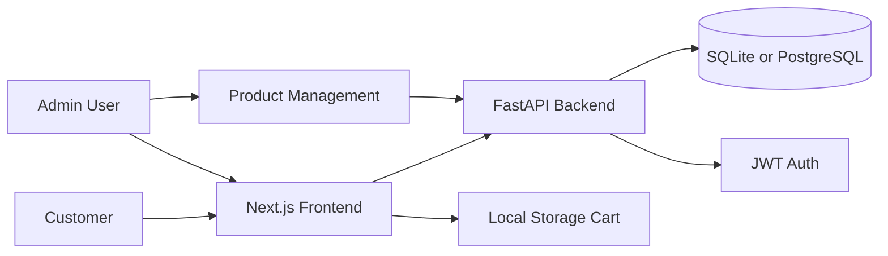
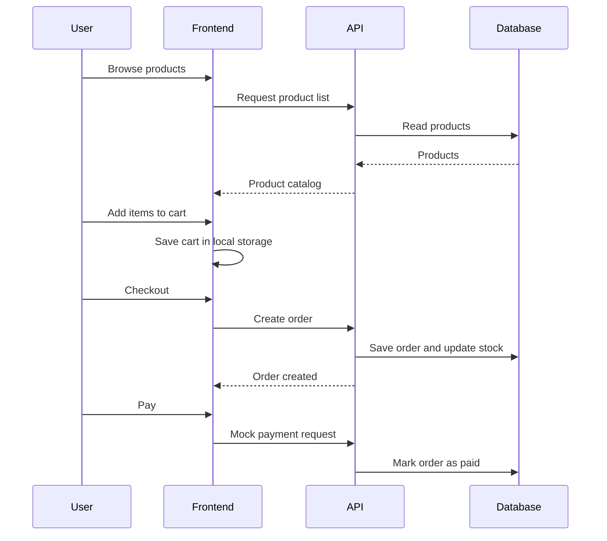

# VendNest

VendNest is a full-stack marketplace starter built with **FastAPI**, **Next.js 14**, **TypeScript**, and **Tailwind CSS**. It gives you the core pieces of an e-commerce app: authentication, product browsing, admin product management, cart handling, checkout, and mock payments.

Use it as a learning project, a portfolio app, or a foundation for a larger marketplace.


## Table of Contents

- [What You Can Do](#what-you-can-do)
- [How It Works](#how-it-works)
- [Tech Stack](#tech-stack)
- [Project Structure](#project-structure)
- [Quick Start](#quick-start)
- [Environment Variables](#environment-variables)
- [API Overview](#api-overview)
- [User Journey](#user-journey)
- [Development Notes](#development-notes)

## What You Can Do

| Area | Capability |
| --- | --- |
| Authentication | Register and log in with JWT-based authentication |
| Authorization | Restrict product management to admin users |
| Products | Browse, search, create, update, and delete products |
| Cart | Store cart items in browser local storage |
| Checkout | Create orders and reduce product stock |
| Payments | Mark orders as paid through a mock payment endpoint |
| Docs | Explore backend APIs through FastAPI OpenAPI docs |
| Database | Run locally with SQLite or through Docker with PostgreSQL |

## How It Works



VendNest has two main parts:

- **Frontend:** A Next.js App Router application for users, carts, login, registration, and admin screens.
- **Backend:** A FastAPI API that handles authentication, product data, orders, and payment status.

## Tech Stack

### Frontend

- Next.js 14
- React 18
- TypeScript
- Tailwind CSS
- SWR

### Backend

- FastAPI
- SQLAlchemy
- JWT authentication
- SQLite for quick local development
- PostgreSQL through Docker Compose
- Uvicorn

## Project Structure

```text
.
+-- backend/
|   +-- app/
|   |   +-- routers/
|   |   |   +-- auth.py
|   |   |   +-- orders.py
|   |   |   +-- products.py
|   |   +-- db.py
|   |   +-- deps.py
|   |   +-- main.py
|   |   +-- models.py
|   |   +-- schemas.py
|   |   +-- security.py
|   +-- requirements.txt
+-- frontend/
|   +-- app/
|   |   +-- admin/products/
|   |   +-- cart/
|   |   +-- login/
|   |   +-- register/
|   |   +-- page.tsx
|   +-- package.json
+-- docker-compose.yml
```

## Quick Start

Choose the setup that matches how you want to run the project.

<details>
<summary><strong>Option 1: Run locally with SQLite</strong></summary>

### 1. Start the backend

```bash
cd backend
python -m venv .venv
source .venv/bin/activate
pip install -r requirements.txt
uvicorn app.main:app --reload
```

On Windows PowerShell:

```powershell
cd backend
python -m venv .venv
.\.venv\Scripts\Activate.ps1
pip install -r requirements.txt
uvicorn app.main:app --reload
```

Backend URL:

```text
http://localhost:8000
```

API docs:

```text
http://localhost:8000/docs
```

### 2. Start the frontend

Open a second terminal:

```bash
cd frontend
npm install
npm run dev
```

Frontend URL:

```text
http://localhost:3000
```

</details>

<details>
<summary><strong>Option 2: Run with Docker and PostgreSQL</strong></summary>

Start the full stack:

```bash
docker compose up --build
```

Useful URLs:

| Service | URL |
| --- | --- |
| Frontend | `http://localhost:3000` |
| Backend | `http://localhost:8000` |
| API Docs | `http://localhost:8000/docs` |

Stop containers:

```bash
docker compose down
```

</details>

## Environment Variables

Create environment files as needed for your local setup.

### Backend

```env
DATABASE_URL=sqlite:///./vendnest.db
SECRET_KEY=change-this-secret
ACCESS_TOKEN_EXPIRE_MINUTES=60
```

For PostgreSQL through Docker:

```env
DATABASE_URL=postgresql://postgres:postgres@db:5432/vendnest
SECRET_KEY=change-this-secret
ACCESS_TOKEN_EXPIRE_MINUTES=60
```

### Frontend

```env
NEXT_PUBLIC_API_URL=http://localhost:8000
```

## API Overview

| Method | Endpoint | Description | Access |
| --- | --- | --- | --- |
| `POST` | `/auth/register` | Create a new user account | Public |
| `POST` | `/auth/login` | Log in and receive a JWT | Public |
| `GET` | `/products` | List and search products | Public |
| `POST` | `/products` | Create a product | Admin |
| `PUT` | `/products/{id}` | Update a product | Admin |
| `DELETE` | `/products/{id}` | Delete a product | Admin |
| `POST` | `/orders/checkout` | Create an order from cart items | User |
| `POST` | `/orders/{id}/pay` | Mark an order as paid | User |

## User Journey



## Development Notes

- Use SQLite when you want the fastest local setup.
- Use Docker Compose when you want a PostgreSQL-backed environment closer to production.
- Admin-only actions require an authenticated user with the correct role.
- Cart state lives in the browser, while orders are saved by the backend.
- FastAPI docs are available at `/docs` whenever the backend is running.

## Suggested Next Improvements

- Add product images and file upload support
- Add order history pages for users
- Add admin dashboards for sales and inventory
- Add payment provider integration
- Add automated tests for API and frontend flows
- Add seed data for demo products and admin users
